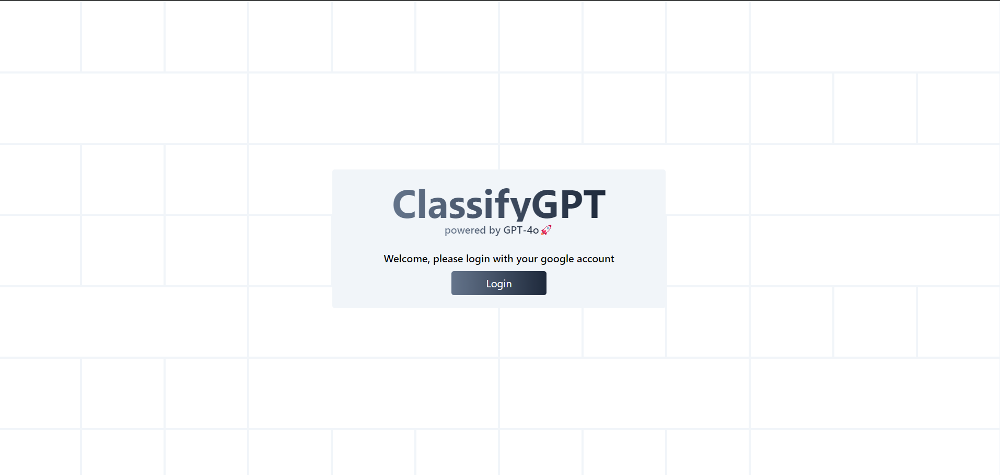
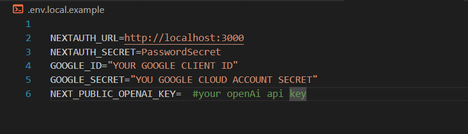

# e-classifygpt ✨🚀



🔴 website  is still not ready for mobile

The website use next-auth for authentication with google as the provider , for fetching gmail we are using google gmail api , and the email classification done using gpt-4o model additionaly the website have framer-motino as a dependecy to add some smooth transition and animation 

## Prerequisites

Before getting started, ensure you have the following installed:

- Node.js and npm ([installation guide](https://nodejs.org/))
- Git ([installation guide](https://git-scm.com/))
- Google Cloud Platform Account with API access enabled : https://developers.google.com/workspace/guides/create-credentials
- OpenAI API Key : https://platform.openai.com/signup

## Getting Started

1. **Clone the repository:**

```bash
git clone https://github.com/Tarunmeena0901/e-classifygpt.git
```

2. **Install dependencies:**

```bash
cd e-classifygpt  

`npm install` or `yarn install`
```

3. **setup your secrets and env varaible**
- first copy the .env.local.example
- rename it to .env.local
- fill your secrets



4. **Run your project localy**
```bash
 npm run dev
 or 
 yarn dev 
```
Your Next.js application should now be running locally at http://localhost:3000.

Additional Resources
- [Next.js Documentation](https://nextjs.org/docs)
- [Google Cloud Documentation](https://cloud.google.com/api-keys/docs/overview)
- [OpenAI API Documentation](https://beta.openai.com/docs/)
